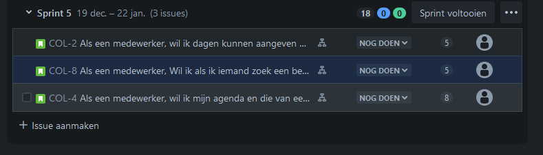
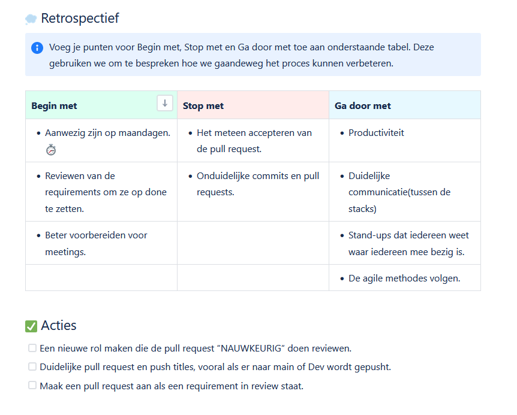

Tijdens het groepsproject hebben wij als groep gewerkt in sprints van 3 weken. Hierbij hebben we aan de start van elke projectdag standups gehouden waarbij de voortgang is besproken met behulp van ons Jira bord.

 

 Aan het eind van elke drie weken hebben wij een sprintoplevering gehouden waarna we ook een sprint retrospective hebben gevoerd waarin wordt besproken wordt wat beter kan, waar we mee door moeten gaan, en waar we mee moeten stoppen.

  

De uitkomst en reflecties van deze retrospectives zijn terug te vinden op onze groeps-Feedpulse.