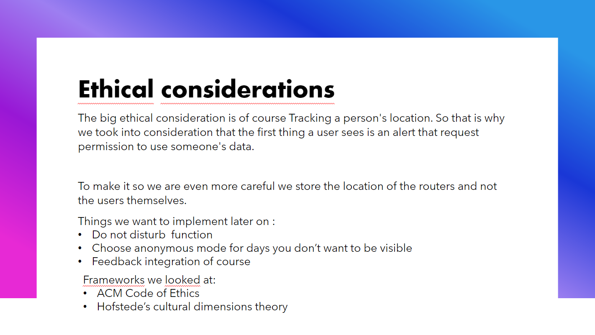
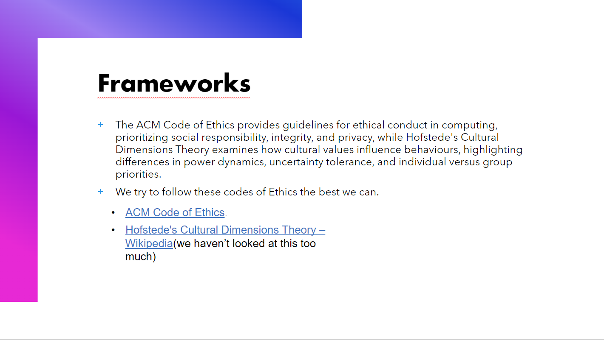
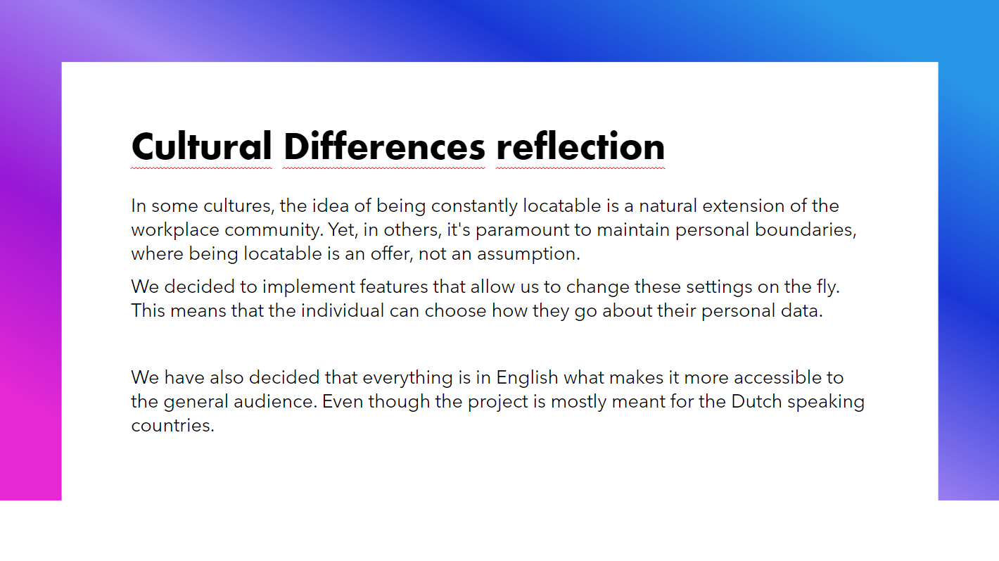

# Cultural differences and ethics
>You recognize and take into account cultural differences between project stakeholders and ethical aspects in software development.
>
>**Recognize:** Recognition is based on theoretically substantiated awareness of cultural differences and ethical aspects in software engineering. 
>
>**Take into account:** Adapt your communication, working, and behavior styles to reflect project stakeholders from different cultures;
>
>Address one of the standard Programming Ethical Guidelines (e.g., ACM Code of Ethics and Professional Conduct) in your work.
>[^1]

# **How we address ethical concerns and cultural differences.**
In different parts of the world, different standards exist, so to make this document as easily available and readable as possible we chose to make it in markdown, as this is a format that can be read by most browsers and text editors without needing to change it in any way, and it can also easily be transformed into html to restore its layout.

Additionally, within our group project we have made a presentation that included details regarding a few different learning outcomes, including this one. Below you can see the slides that are relevant to this outcome.

This slide discusses ethical considerations we made and planned to implement. As our group project focused on tracking user locations it was essential that we treat their privacy very carefully as to not overstep their boundaries or put our users at risk.

Here, we discussed the frameworks we used to draw certain conclusions regarding ethical aspects we wanted to take into consideration for our application.

Lastly, we discussed potential cultural differences that could arise regarding our userbase and what actions we take to ensure users of various cultures can comfortably and easily use our application.
[^2]
[^3]

---
### **Sources**
[^1]: Canvas. (n.d.). Canvas outcomes. Retrieved october 4th, 2023, from https://fhict.instructure.com/courses/13181/outcomes  
[^2]: Association for Computing Machinery. (2018). ACM Code of Ethics and Professional Conduct. Retrieved october 4th, 2023, from https://www.acm.org/code-of-ethics 
[^3]: Wikipedia contributors. (2023, November 27). Hofstede’s cultural dimensions theory. Wikipedia. https://en.wikipedia.org/wiki/Hofstede%27s_cultural_dimensions_theory 
